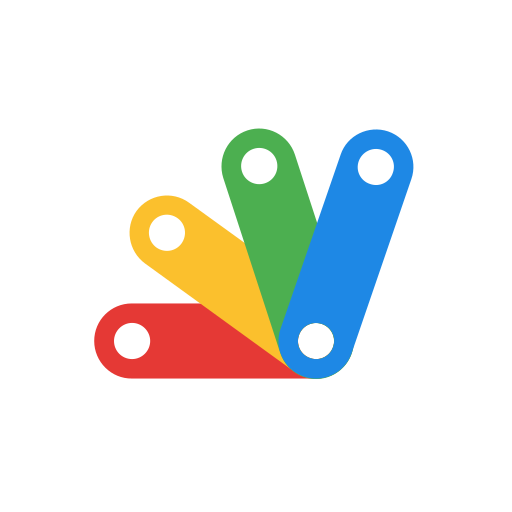

## Hi, my name is Leo 👋

I'm a fourth year student who is studying Communication & Multimedia Design at the Amsterdam University of Applied Sciences. I specialise in front-end development and am currently looking for a 20 week internship.

<!-- Wish to know more about me? Check out [my portfolio](https://leo-kramer.github.io/portfolio-v2/)! -->

### Skills
Here’s a snapshot of my technical toolkit, that allows me to deliver high-quality digital products:

       

### Work
Here is a list of repositories that might be worth checking out:
- [Sandscript](https://github.com/leo-kramer/SandScript)
- [Avatar: The Game](https://github.com/leo-kramer/avatar-game)
